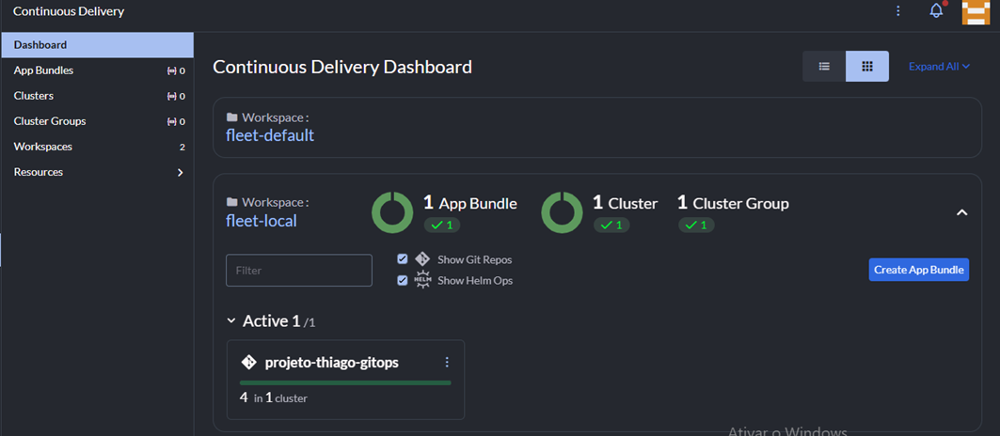
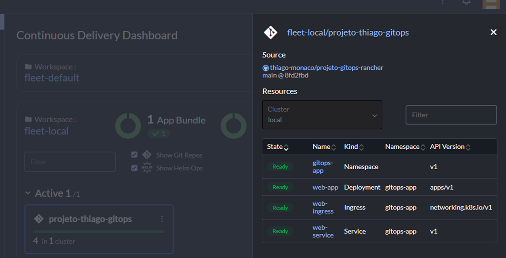
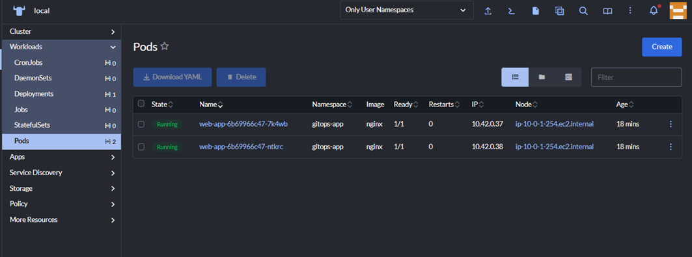
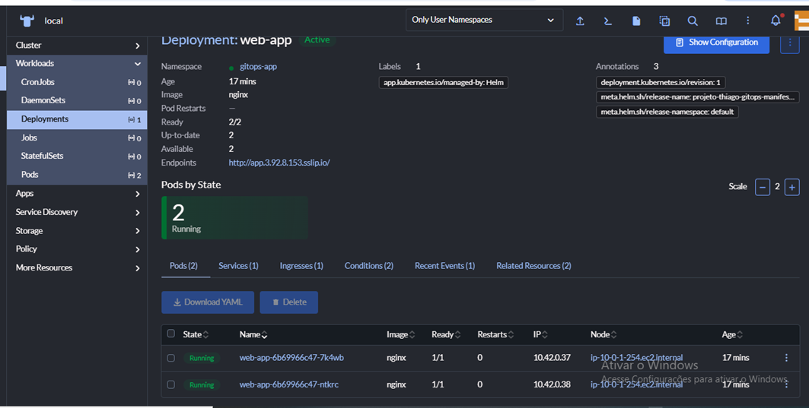

# 🚀 Projeto de Orquestração & GitOps: Rancher + Fleet

Este repositório faz parte de um laboratório (Sandbox) de infraestrutura Cloud Native, focado na implementação de um modelo de **Continuous Delivery** automatizado.

## 🛠️ Tecnologias e Ferramentas
* **Orquestrador:** Kubernetes (K3s)
* **Plano de Controle:** [SUSE Rancher](https://www.rancher.com/)
* **GitOps Engine:** Rancher Fleet
* **Infraestrutura:** Cloud (AWS)
* **Acesso Externo:** Nginx Ingress Controller

## 🏗️ Fluxo de Funcionamento (GitOps)
O projeto utiliza a ferramenta **Fleet** para garantir que o estado do cluster esteja sempre em conformidade com o que está definido neste repositório:
1. Os manifestos YAML são gerenciados na pasta `/manifestos`.
2. O **Fleet** monitora o repositório e detecta novos commits automaticamente.
3. O deploy é realizado de forma automatizada no namespace `gitops-app`.

## 📂 Estrutura de Manifestos
* `deployment.yaml`: Definição dos Pods, réplicas e imagem da aplicação.
* `service.yaml`: Exposição interna da aplicação (ClusterIP).
* `ingress.yaml`: Configuração do roteamento externo para acesso via navegador.

## 📸 Evidências do Ambiente

### 1. Gestão e Monitoramento (Rancher)
O dashboard principal do Rancher fornece uma visão clara da saúde dos nós e dos recursos de hardware utilizados no cluster.

### 2. Automação GitOps (Fleet)
Aqui vemos o status dos **Bundles** do Fleet. Esta tela prova que o repositório Git está sincronizado com o cluster e que a automação está ativa.

### 3. Saúde dos Pods e Deployment (Kubernetes)
Dentro do namespace `gitops-app`, podemos auditar os recursos provisionados:

*Pods em estado Running, confirmando a correta orquestração.*

*Gerenciamento de réplicas garantindo a disponibilidade da aplicação.*

---
*Laboratório desenvolvido para validação de conceitos de orquestração e automação de infraestrutura.*
